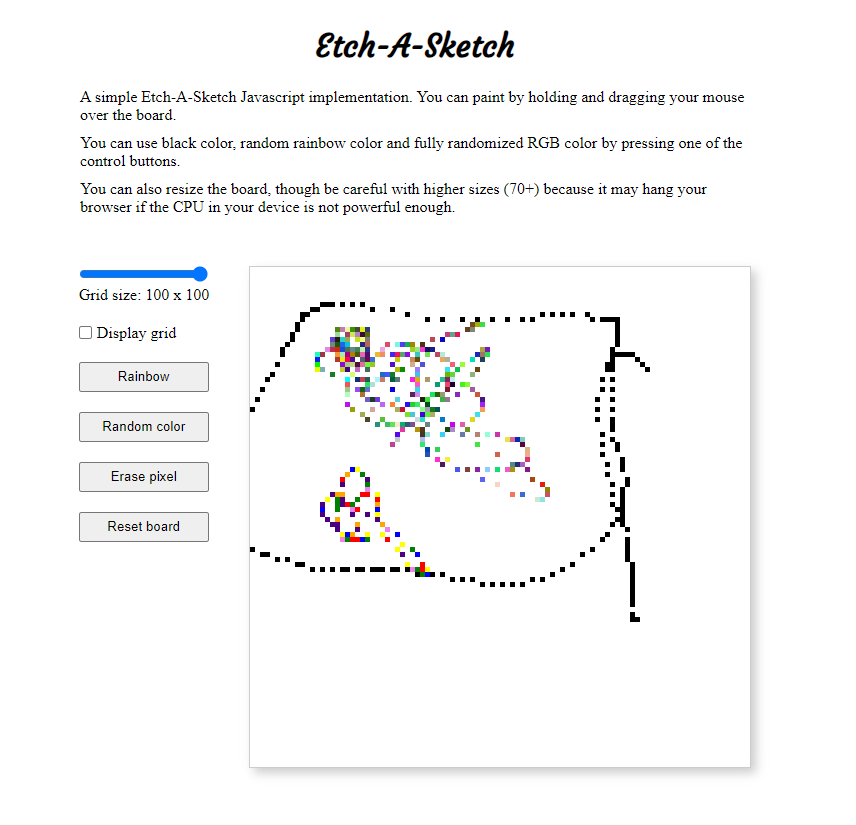

# sketch-js

This is a simple Etch-A-Sketch page.

Supports:
- board resizing
- painting with the black color
- painting with a random color of a rainbow
- painting with a randomized RGB color
- pixel eraser
